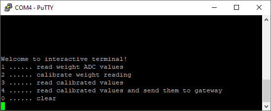
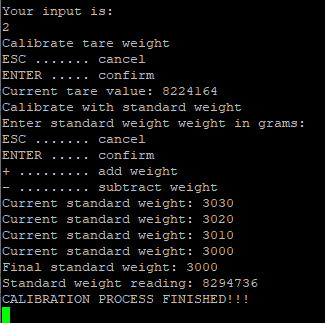
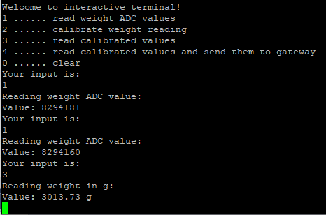
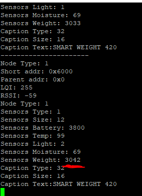

# ⚖️ MPC-SSY-Project - LWM Weight Measurement System
**Jakub Lepik | 239122**

This project was done during the MPC-SSY course at FEEC BUT.  
The weight measuring system reads values from an HX711 ADC board and sends data to an LWM gateway over a wireless network. The system is controlled and calibrated via a serial terminal (e.g., PuTTY).  

Thanks to the large weight scale using four load cells connected through an HX711 ADC, the system can accurately measure heavy objects like a beer keg by distributing the weight across all sensors. 🍺

---

## ✨ Features

- 💻 **Serial Menu Interface** via UART (e.g. PuTTY)
- ⚖️ **Weight Measurement** using HX711 sensor
- 🛠️ **Calibration Support** (Taring and scaling with a known weight)
- 📊 **Data Reporting**: Raw and calibrated values displayed in terminal
- 📡 **Wireless Communication** using custom NWK protocol stack
- 🌐 **Gateway Communication**: Sends sensor packets to central LWM coordinator

---

## 📋 Menu Overview

Shown in `assets/menu.png`. After startup and connecting via UART at baud 38400, user is presented with:  

---

## ⚙️ Functionality

### Calibration  
Two-step process:  
- **Taring**: Set baseline with no weight (zero offset)  
- **Scaling**: Enter known standard weight and calculate scaling factor  

### Raw ADC and Calibrated Value Reading  
- 📈 Displays the raw 24-bit HX711 ADC value directly  
- ⚖️ Applies tare and scale factor to show weight in grams  

### Send Data to Gateway  
📡 Continuously reads and sends sensor data (dummy values for battery, temperature, moisture, light) and calibrated weight ⚖️ to a wireless LWM gateway.  

---

## 🧠 Code Structure

- `main.c`: Main logic, serial interface, and control loop
- `Hx711_read()`: Reads raw 24-bit weight from HX711
- `get_weight_in_grams()`: Converts ADC to grams using calibration
- `appSendData()`: Packages and sends sensor data

---

## 🛠️ Build & Flash

- 🧱 **Platform**: AVR (e.g., ATmega128)
- 🧰 **Build System**: Atmel Studio or `avr-gcc`
- 🔌 **Serial Interface**: 38400 baud UART (Use PuTTY or similar)

---
